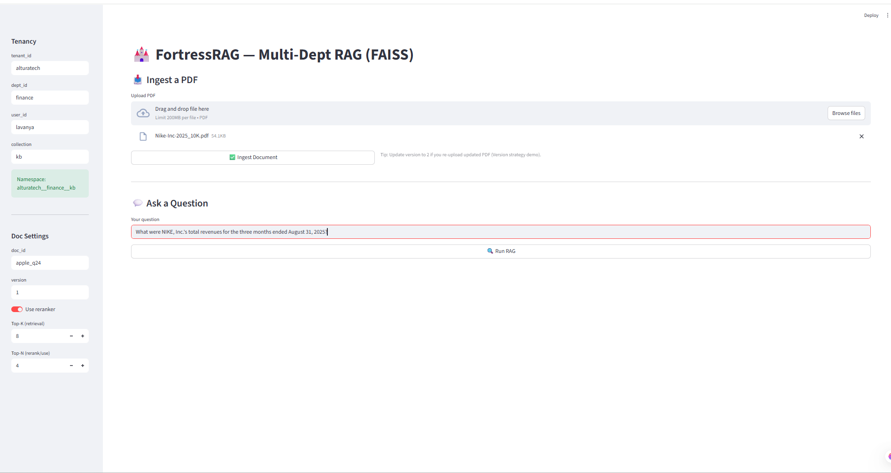
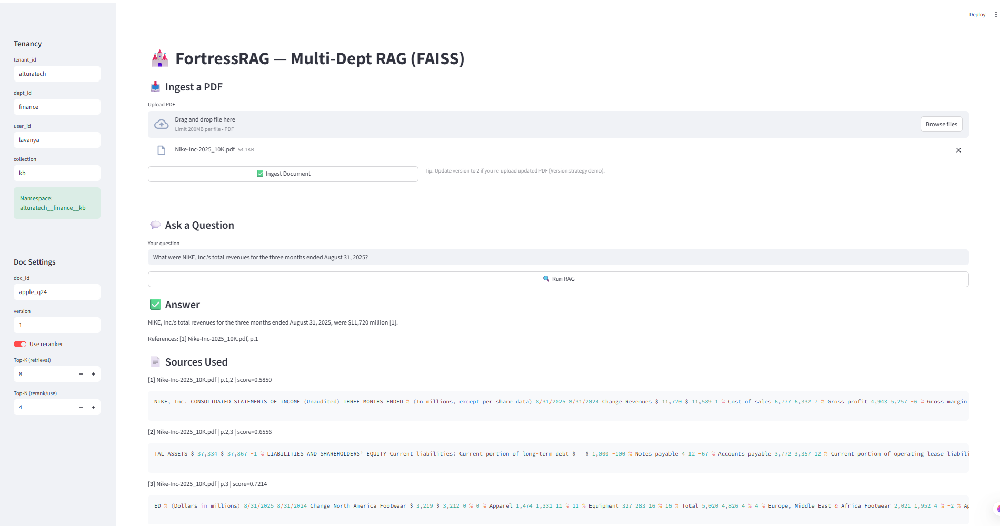

# 🏰 FortressRAG
### Multi-Tenant • Versioned • Governed RAG (FAISS + Optional Reranker)

FortressRAG is an enterprise-oriented Retrieval-Augmented Generation (RAG) system built with **FastAPI**, **FAISS**, and **OpenAI** models.  
It supports **multi-department / multi-user tenancy isolation**, **document versioning with governance**, **duplicate detection using SHA256**, optional **LLM reranking**, and **latency tracking** across the full RAG pipeline.

This project is designed to behave like a real enterprise knowledge assistant:
- grounded answers only from documents
- citations and references
- version-aware ingestion
- tenant-aware storage and retrieval

---

## ✅ Features

- 🔐 **Tenancy Isolation**
  - Dept-level shared index (cost-effective)
  - User-level isolated index (maximum separation)

- 📄 **Document Governance + Versioning**
  - Manifest-based lifecycle: **ACTIVE / DEPRECATED**
  - Duplicate detection via **SHA256 hash**
  - Tracks active version per document

- 🧠 **RAG Pipeline**
  - FAISS similarity search (Top-K)
  - Optional reranker (Top-N)
  - Strict answer generation with citations

- ⏱ **Latency Metrics**
  - retrieval / rerank / generation / total

- 🧾 **Citations**
  - Inline citations like **[1], [2]**
  - References section at the end

---

## 📸 Screenshots






---

## 🧱 Architecture

```mermaid
flowchart TB

subgraph API["FastAPI API"]
H["/health"]
I["POST /ingest"]
C["POST /chat"]
end

subgraph ING["Ingestion Layer"]
P1["Load PDF (pypdf)"]
P2["Extract text per page"]
P3["Chunking + Page Tracking"]
P4["SHA256 hash"]
R["Build Records (doc_id, version, pages, chunk_id)"]
end

subgraph GOV["Governance Layer"]
M["Manifest JSON (storage/manifests)"]
DUP["Duplicate detection (active_doc_hash)"]
VER["Version lifecycle: ACTIVE -> DEPRECATED"]
end

subgraph STORE["Embedding + Storage"]
E["OpenAI Embeddings"]
F["FAISS Index (storage/indexes/<namespace>/current)"]
end

subgraph QP["Query Pipeline"]
S1["Similarity Search (Top-K)"]
S2{"use_reranker?"}
RR["LLM Rerank (Top-N)"]
CTX["Context Builder + Citations"]
G["LLM Answer Generation"]
OUT["Answer + Sources + Latency"]
end

I --> P1 --> P2 --> P3 --> P4 --> R --> M --> E --> F
C --> S1 --> S2
S2 -->|Yes| RR --> CTX --> G --> OUT
S2 -->|No| CTX --> G --> OUT
