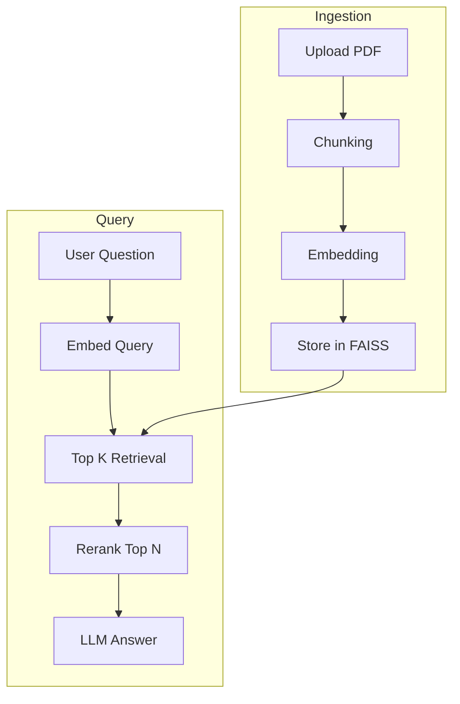

## 🏗 Architecture Diagram


````

⚠ Important:

* Triple backticks + mermaid
* Exactly like above
* No extra space before ```mermaid

---

# 🎯 Aapke Repo ke liye Final Structure Should Be:

```
FortressRAG/
│
├── assets/
│   ├── rag_architecture.mmd
│   ├── rag_architecture.png
│   ├── First_Screenshot.png
│   ├── Second_Screenshot.png
│   ├── Third_Screenshot.png
│
├── streamlit_app.py
├── requirements.txt
└── README.md
```

---

# 📸 Screenshot Section Add Karo README me

```markdown
## 📸 Application Screenshots

### 1️⃣ Document Ingestion


### 2️⃣ Query Interface


### 3️⃣ Answer with Citations

```


---


